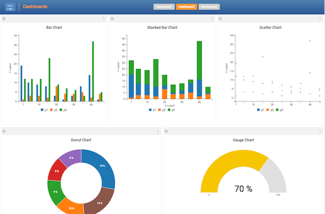
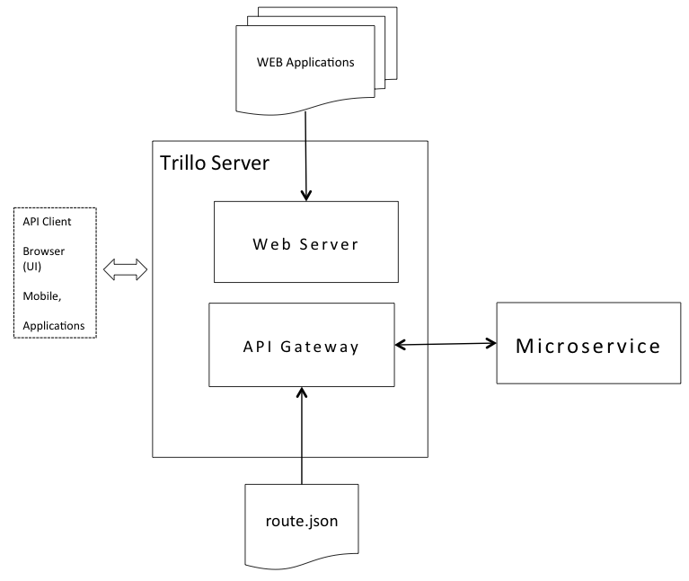

# trillo-microservice-sample

## Running Sample Application

Let us run the sample application to get a feel of it. In order to do so, clone this repo and follow these steps.

* You need Java 8 Runtime to use Trillo Server. Please download it from [Oracle Website](http://www.oracle.com/technetwork/java/javase/downloads/jre8-downloads-2133155.html)

* Trillo Server runs on port 8080 (change application.yml to run on a different port).

* Microservice runs on port 8090 (change the script to run on a different port. But then you have to change "route.json" as well).
* "cd" to "trillo-server" directory.

* Execute "startTrilloServer.sh" on Mac or Linux. Or execute "startTrilloServer.bat" on windows. ( you may have to do chmod +x)

* In another window, "cd" to "microsvc-bin" directory.

* Execute "startMicroService.sh" on Mac or Linux. Or execute "startMicroService.bat" on windows.

* In you browser, access the URL: http://localhost:8080.


**If everything goes well you will see the following application in your browser.**





## Architecture of Application

The components contained in this repo are:

* Trillo Server.
* A Sample WEB application (dashboard).
* A Sample Microservice. 

The WEB application is served by Trillo Server acting as web-server. Trillo Server also acts as API gateway to
the sample microservice.

[Please refer to trillo-server repo for more details about Trillo Server.](https://github.com/trillo/trillo-server)

Let us review its architecture.

* Trillo Server works both as a WEB Server and API Gateway.

* It serves application content from "applications" sub-directory. (Trillo apps are different from webapps served by conventional 
servlet containers). The application consists of HTML templates, CSS, JS and media files. 
The sample application is contained inside applications/org1 directory. 
Refer to [Trillo Server](https://github.com/trillo/trillo-server) for the details of the directory structure.

* As API gateway it forwards rest calls to a microservice.

* Trillo Server runs on port 8080 (due to settings in the scripts / property files).

* Microservice runs on port 8090.

* Due to the following route.json, Trillo Server forwards all rest calls with URL pattern "api/data/*" to microservice.
```
  [
    {
      path : "api/data/*",
      location: "http://localhost:8090/data",
      roles: "*"
    }

  ]
```


**The following diagram shows the components of the sample code in this repo.**





* The sample WEB application is a dashboard (built using TrilloJS).

* It is a single page rich UI.

* It uses rest calls (ajax) to retrieve data which are served by the microservice.


## Microservice Source Code

* Microservice source code is contained inside "microservice" directory.

* This is a trivial Spring Boot based micro service.

* All it does is, server one the "json" files inside "database" sub-directory, based on URL path.
